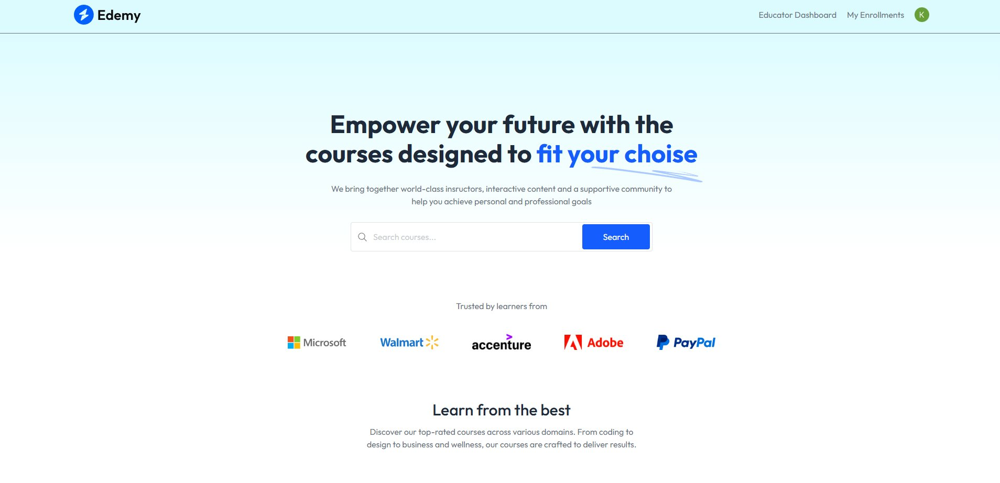
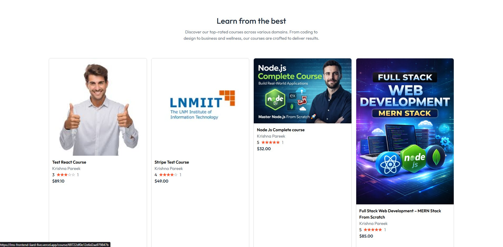
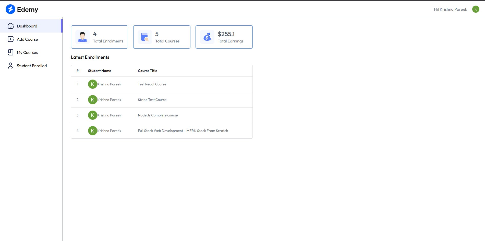
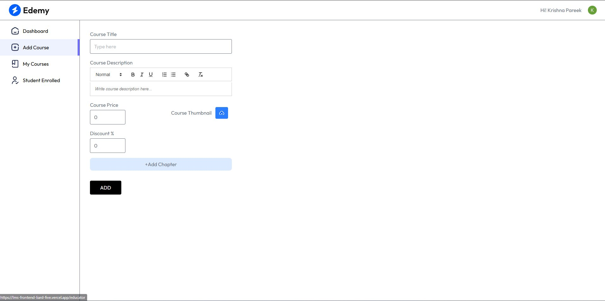
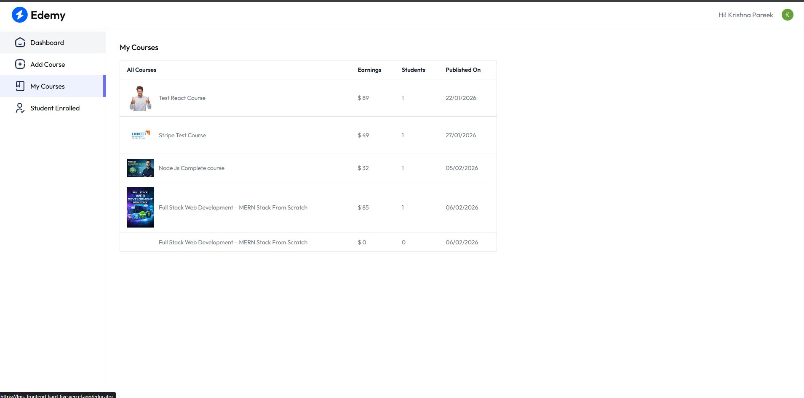
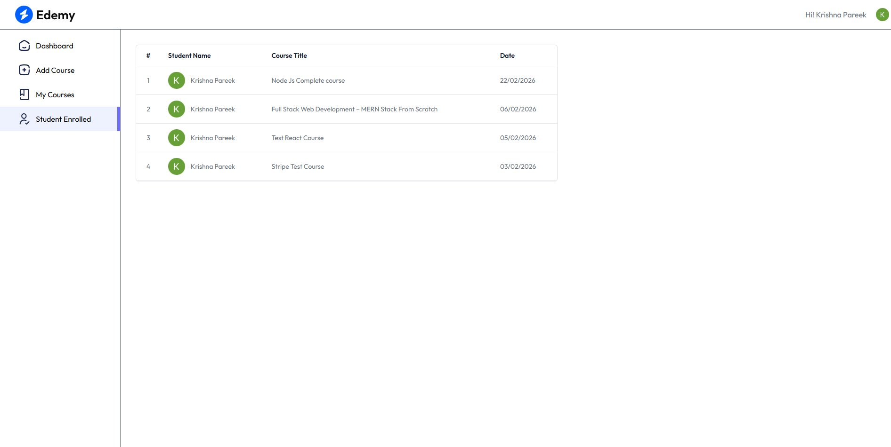
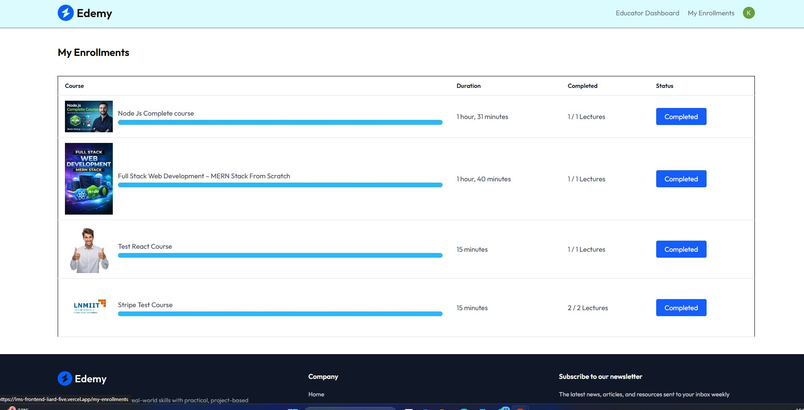
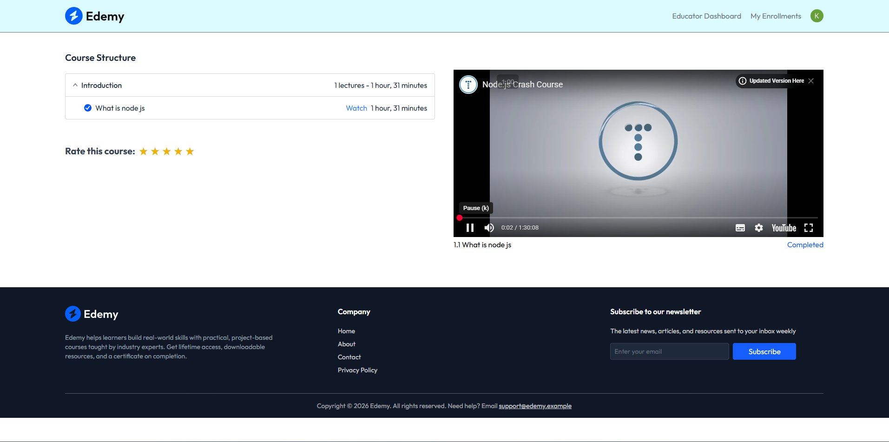

# Edemy — Learning Management System 🎓

A full-stack dual-portal LMS where educators publish courses and students enroll, learn, and track progress. Built with real Stripe payments, role-based access, and a live educator analytics dashboard.

🔗 **[Live Demo](https://lms-frontend-liard-five.vercel.app)**

---

## 🖥️ Screenshots

### Home Page

> Course discovery page with search bar, featured courses, trusted brand logos (Microsoft, Walmart, Adobe, PayPal, Accenture), testimonials, and CTA sections

---

### Course Listings

> All available courses displayed with thumbnails, educator name, star ratings, and pricing — students can browse and enroll instantly

---

### Educator Dashboard

> Real-time analytics showing total enrollments (4), total courses (5), and total earnings ($255.1) — with a latest enrollments table showing student names and course titles

---

### Add Course (Educator)

> Full course creation form — title, rich text description editor, price, discount percentage, thumbnail upload via Cloudinary, and chapter management

---

### My Courses (Educator)

> Educator's published courses table with per-course earnings, student count, and publish date

---

### Students Enrolled (Educator)

> Educator view of all students enrolled across all courses, with enrollment dates

---

### My Enrollments (Student)

> Student dashboard showing enrolled courses with thumbnails, total duration, lecture completion count (e.g. 1/1 Lectures), and Completed status badges

---

### Course Player

> Per-lecture YouTube-embedded video player with lecture completion tracking, course structure sidebar, and 5-star rating system

---

## ✨ Features

### 🧑‍🎓 Student Portal
- Browse and search courses from the home page
- Enroll via **Stripe-powered payment gateway**
- Toast notification if course already purchased
- Per-lecture video player with completion tracking
- Rate courses with a 5-star rating system
- My Enrollments dashboard with duration and completion status

### 👨‍🏫 Educator Portal
- Analytics dashboard — total enrollments, courses, earnings
- Create courses with rich text description, thumbnail, pricing, and discount %
- Chapter-based course structure with video lectures
- View all enrolled students per course with enrollment dates
- Per-course earnings and student count tracking

### 💳 Payments
- Stripe payment gateway integration for course purchases
- **Stripe webhook validation** to prevent unauthorized access on payment race conditions
- Toast notification for already-purchased courses

---

## 🛠️ Tech Stack

| Layer | Technology |
|-------|-----------|
| Frontend | React.js, Tailwind CSS |
| Backend | Node.js, Express.js |
| Database | PostgreSQL, MongoDB |
| Payments | Stripe + Webhooks |
| Video | YouTube Embed API |
| Deployment | Vercel |
| Auth | Role-based (Educator / Student) |

---

## 🚀 Getting Started

```bash
# Clone the repo
git clone https://github.com/PareeKrishna/lms
cd lms

# Install frontend dependencies
cd frontend
npm install
npm run dev

# Install backend dependencies
cd ../backend
npm install
npm start
```

### Environment Variables

Create a `.env` file in the backend directory:

```env
DATABASE_URL=your_postgresql_url
MONGODB_URI=your_mongodb_uri
STRIPE_SECRET_KEY=your_stripe_secret
STRIPE_WEBHOOK_SECRET=your_webhook_secret
JWT_SECRET=your_jwt_secret
```

---

## 🏗️ Architecture Highlights

- **Dual-portal access** — single codebase, two completely different user experiences based on role
- **Stripe webhook validation** — server verifies payment events before granting course access, preventing race conditions
- **Per-lecture completion tracking** — each lecture marked individually, progress persisted in database
- **Educator analytics** — aggregated earnings and enrollment data computed server-side per educator
- **Rich text editor** — educators write course descriptions with formatting support

---

## 🧪 Live Demo Credentials

**Student account:**
Email: `test@student.com` | Password: `test123`

**Educator account:**
Email: `test@educator.com` | Password: `test123`

**Stripe test card:** `4242 4242 4242 4242` | Any future date | Any CVC

---

## 📄 License
MIT
